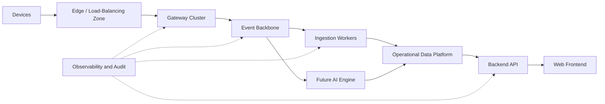
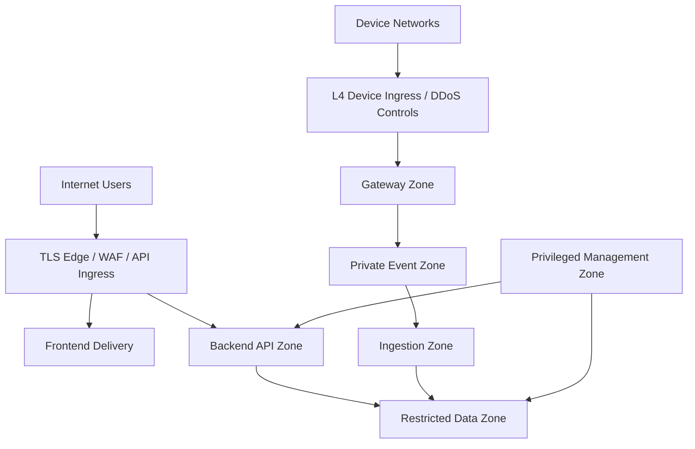

# ALELS Platform Architecture Blueprint

## Purpose and status

This document is the official long-term architecture blueprint for ALELS. It describes intended boundaries and evolution paths; it does not assert that every future component exists or authorize implementation.

## Platform layers

| Layer | Responsibility | Boundary |
| --- | --- | --- |
| Device/edge | Device connectivity and network ingress | Untrusted external zone |
| Gateway | Protocol detection, sessions, decode, acknowledgement, normalization, command transport | No business/UI ownership |
| Event backbone | Durable decoupling, partitioning, buffering, replay | No domain business rules |
| Ingestion | Validate events, deduplicate, batch, persist, quarantine failures | No device protocol ownership |
| Backend | Domain use cases, authorization, APIs, administration and monitoring | No packet decoding |
| Data platform | Durable operational, telemetry, audit, and reference data | Access through owned interfaces |
| Frontend | User interaction and presentation | No authoritative authorization |
| Future AI engine | Offline/stream inference and recommendations | No direct bypass of domain/security controls |

## Current module responsibilities

- `gateway/`: device TCP communication, protocol detection/parsing, normalization, sessions, commands, telemetry publication or established persistence path.
- `ingestion-service/`: event consumption, batching, deduplication, persistence, pipeline health, dead-letter handling.
- `backend/`: authenticated domain APIs, server operations, organization, master/register data, assignments, audit and monitoring views.
- `database/`: baseline schema, ordered migrations, seed and controlled recovery assets.
- `web-react/`: routed React user interface, feature APIs, shared components, stores and layouts.
- `deploy/`: current server, proxy, service and container deployment assets.
- Future AI engine: separately governed consumer/producer using versioned events and auditable model outputs.

## Telemetry, event, and data flow

1. A device opens an authenticated/identified network session and sends protocol bytes.
2. Gateway bounds framing, detects protocol, retains established raw evidence, decodes and acknowledges according to protocol semantics.
3. Gateway normalizes fields with explicit units/timestamps and publishes a versioned telemetry event to the event backbone.
4. Partitioning preserves required per-device ordering. The backbone buffers spikes and supports controlled replay.
5. Ingestion consumers validate, deduplicate, batch and persist telemetry; irrecoverable records enter a governed dead-letter path.
6. Backend reads authorized operational views; frontend receives only tenant-scoped API DTOs.
7. Commands flow from authorized backend intent through durable command state to the owning gateway session; responses return through correlated events/state.
8. Future AI consumers read governed streams or curated data and publish recommendations/events through reviewed contracts, never direct UI authority.

Raw, normalized, enriched, persisted, and presented records must remain traceable using stable device, tenant, event-time, receive-time, protocol, and correlation identifiers.

## Multi-tenant architecture

- Tenant/company identity is an invariant propagated from authenticated context to service and persistence filters.
- Device ownership is resolved before telemetry or command data becomes visible to a tenant.
- Server-side authorization is authoritative; frontend visibility is usability only.
- Cross-tenant administration requires explicit privileged policy and audit.
- Data stores use consistent tenant/company keys, constraints where feasible, and tests for denied cross-tenant access.
- Future scale may use tenant-aware partitioning, quotas and data placement, but must preserve global device uniqueness and controlled hierarchy.

## Security zones and trust boundaries

Every boundary authenticates workload or user identity, authorizes least privilege, encrypts traffic where supported, validates input, limits rate/volume, and emits auditable security signals. Data and management zones are not directly internet-accessible.

## Inter-service communication

- Device ↔ gateway: bounded protocol-specific TCP contracts.
- Gateway → event backbone → ingestion: asynchronous, versioned telemetry events with partition, retry, replay and dead-letter policy.
- Backend ↔ database: parameterized, pooled, tenant-aware transactions.
- Frontend ↔ backend: HTTPS JSON APIs with existing authentication and compatibility rules.
- Backend → command pipeline → gateway: durable, correlated, idempotency-aware command intent and response.
- Services → observability: structured logs, metrics and traces outside business data paths.

Synchronous service chains should be minimized. Contract ownership, timeouts, retries, idempotency, ordering and failure behavior must be explicit.

## Future scaling strategy

- Scale stateless API and ingestion workers horizontally.
- Scale gateway connections using stable device-to-node affinity and a distributed session/command ownership model.
- Partition event streams by stable device identity; separate high-volume topics and consumer groups by responsibility.
- Partition/archive telemetry by time and tenant/device dimensions based on measured workloads.
- Use read replicas or derived stores for analytics; keep transactional writes isolated.
- Enforce admission control, backpressure, quotas, retention, and capacity headroom.
- Validate each scale tier through workload models, soak/failure tests and cost envelopes before promotion.

Detailed tiers are defined in `SCALABILITY_STRATEGY.md`.

## High availability and disaster recovery

Production target architecture removes single points of failure across ingress, gateway, broker, ingestion, API and database. Multi-zone redundancy is the normal HA boundary; cross-region recovery is governed by business-approved RPO/RTO. Backups, restore drills, failover and failback are mandatory and distinct from replication.

## Future cloud deployment

The blueprint is cloud-neutral:

- managed or clustered PostgreSQL with backups and point-in-time recovery;
- multi-zone event backbone with replicated partitions;
- containerized, autoscaled stateless services;
- L4 load balancing for devices and L7 ingress for APIs;
- object storage for archives/backups;
- managed secrets and workload identity;
- centralized observability and security controls;
- infrastructure and policy defined as reviewed code.

Cloud adoption must avoid provider coupling in domain/event contracts and must preserve a tested exit/recovery path.

## Architecture governance

Significant changes require an ADR, compatibility assessment, threat model, data classification, capacity evidence, deployment/rollback plan and owner review. Existing implementations remain unchanged until separately approved work realizes this blueprint.

## Future recommendations

Prioritize contract inventories, workload baselines, automated tests/CI, observability standards, HA design validation, backup/restore drills and a versioned event catalog before implementing large-scale architecture changes.
