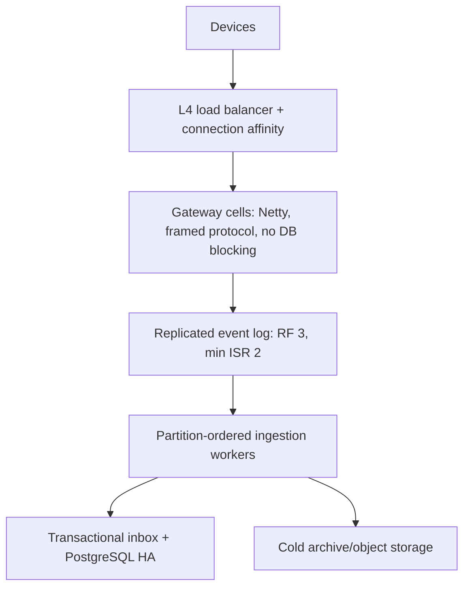

# Audit Teknis Menyeluruh ALELS Platform

**Tanggal audit:** 8 Agustus 2026
**Artefak:** `alels-platform-work.zip`
**Target:** ratusan ribu hingga 1 juta perangkat online, penerimaan data tanpa hambatan, platform dan database stabil, serta tidak ada critical error yang diketahui.

## 1. Putusan eksekutif

**Status: TIDAK LAYAK GO-LIVE untuk target 100 ribu–1 juta perangkat.**

Kode saat ini belum dapat disertifikasi bahkan untuk target 100 ribu koneksi. Ada beberapa jalur yang dapat menyebabkan kehilangan telemetry secara diam-diam, korupsi framing TCP, bottleneck total pada PostgreSQL, kebocoran memori/sesi, dan deployment single-point-of-failure. Nilai berikut adalah skor kesiapan statis, bukan hasil benchmark:

| Area | Skor | Status |
|---|---:|---|
| Gateway dan koneksi masif | 15/100 | Gagal |
| Integritas ingestion | 15/100 | Gagal; ada risiko kehilangan data |
| Database dan write path | 25/100 | Gagal untuk skala target |
| High availability/deployment | 10/100 | Gagal |
| Security | 20/100 | Gagal |
| Testing/release assurance | 5/100 | Gagal; tidak ada test suite/CI |
| Frontend | 70/100 | Build/typecheck lulus, tetapi ada kelemahan auth/dependency |
| **Keseluruhan** | **22/100** | **No-go** |

Evaluasi terhadap target:

| Target | Hasil audit | Alasan utama |
|---|---|---|
| 100 ribu–1 juta device online | **Gagal** | Default gateway membuat satu thread per koneksi; jalur Netty pun masih melakukan I/O PostgreSQL sinkron per paket. |
| Data semua device diterima tanpa terhambat/hilang | **Gagal kritis** | Framing TCP tidak benar, deduplikasi Teltonika salah, ACK diberikan sebelum Kafka durable, retry dapat mengubah data gagal menjadi “duplicate”. |
| Platform stabil dan kuat | **Gagal** | State hanya lokal, map tidak dibersihkan, tidak ada HA, backpressure, graceful degradation, atau observability memadai. |
| Database kuat | **Gagal/parsial** | Ada partisi dan batch insert, tetapi write amplification sangat besar, job meng-update seluruh tabel setiap 30 detik, dan tidak ada HA/PITR yang terpasang. |
| Zero critical bug/error | **Gagal** | Ditemukan 14 kelas masalah kritis; tidak ada automated tests atau CI sehingga klaim zero-critical tidak dapat dibuktikan. |

Fondasinya tidak sepenuhnya buruk: pemisahan gateway/ingestion/backend sudah mengarah benar; producer Kafka mengaktifkan idempotence dan `acks=all`; ingestion memakai HikariCP dan batch JDBC; migrasi mulai memakai partisi waktu; frontend berhasil dibangun. Namun jalur eksekusi aktual masih bertentangan dengan arsitektur skala besar tersebut.

## 2. Ruang lingkup dan batas audit

Audit mencakup source Java backend, gateway dan ingestion; React frontend; SQL migration/seed/recovery; Docker Compose, systemd, Nginx; configuration; dependency manifests; serta dokumentasi engineering. Terdapat 257 file Java produksi dan tidak ditemukan satu pun source test.

Verifikasi yang dilakukan:

- Inspeksi statis alur TCP → parser → Kafka → ingestion → PostgreSQL, termasuk jalur gagal dan retry.
- Pemeriksaan multitenancy/auth, session/token, command routing, cache/state, migration, indeks, partisi, dan deployment.
- `npm run typecheck`: **lulus**.
- `npm run build`: **lulus** setelah optional binary Rollup Linux dipasang hanya pada salinan audit; source aplikasi tidak diubah.
- `npm audit`: dependency produksi melaporkan 1 high dan 2 moderate; keseluruhan dependency melaporkan 3 high dan 2 moderate, tanpa critical pada hasil audit npm saat ini.

Yang belum dapat dilakukan pada lingkungan audit:

- Build/test Java: Maven tidak tersedia dan runtime Java yang tersedia adalah 17, sedangkan POM meminta Java 21.
- Menjalankan PostgreSQL/migration, Kafka/Redpanda, Docker Compose, integration test, pentest, serta load/soak/failover test.
- Karena itu laporan ini adalah **deep static audit**, bukan sertifikasi kapasitas. Klaim 1 juta koneksi baru sah setelah perbaikan dan uji beban terukur pada infrastruktur representatif.

## 3. Temuan kritis — wajib diperbaiki sebelum produksi

### C-01 — Mode default gateway adalah satu native thread per koneksi

**Bukti:**

- `gateway/src/main/java/com/alels/gateway/Main.java:53-58` memilih `legacy` bila `ALELS_TCP_SERVER` tidak diisi.
- `gateway/src/main/java/com/alels/gateway/server/HybridTcpServer.java:14-19` menjalankan `new Thread(new ClientSession(socket)).start()` untuk setiap socket.
- `deploy/systemd/alels-gateway.service` tidak mengatur `ALELS_TCP_SERVER=netty`.

Pada 100 ribu koneksi, thread stack, scheduler dan context switching sudah dapat menghabiskan resource host. Satu juta native thread bukan target yang realistis. Bahkan implementasi Netty sekarang belum aman karena temuan C-02, C-06 dan C-07.

**Perbaikan:** hapus mode legacy dari jalur produksi; fail startup kecuali mode Netty aktif; gunakan native transport Linux bila tervalidasi; atur event-loop berdasarkan core; tambahkan batas koneksi, admission control, idle timeout, write-buffer watermark, bounded worker pool dan graceful drain. Tambahkan `LimitNOFILE` dan tuning kernel yang dibuktikan lewat test, bukan sekadar angka konfigurasi.

### C-02 — Decoder Netty memperlakukan setiap read TCP sebagai satu paket aplikasi

**Bukti:**

- `gateway/src/main/java/com/alels/gateway/netty/NettyProtocolDecoder.java:21-26` membaca seluruh byte yang saat itu tersedia dan langsung membentuk satu packet.
- TCP boleh memecah satu frame menjadi beberapa read atau menggabungkan beberapa frame ke satu read. Decoder tidak memiliki cumulation, length-field framing, batas frame, atau resynchronization.
- `ProtocolDetector.java:21-25` memilih codec dari byte indeks 8 tanpa memvalidasi preamble atau panjang.
- `TeltonikaImeiParser.java:9-11` mempercayai declared length tanpa bounds check.
- `gateway.properties` memiliki `idleTimeout`, tetapi tidak dipasang sebagai `IdleStateHandler`.

Akibatnya paket valid dapat terpotong, dua paket dapat dianggap satu, parser dapat membaca di luar batas, perangkat dapat di-ACK salah, dan data dapat hilang. Client juga dapat mengirim length ekstrem untuk DoS.

**Perbaikan:** buat state machine/frame decoder terpisah untuk IMEI handshake, Teltonika Codec 8/8E, dan ALELS; tunggu seluruh declared frame; izinkan banyak frame per read; tetapkan ukuran maksimum; validasi preamble, codec, count, data length, trailing bytes; tutup koneksi dengan reason metric bila invalid; tambahkan fuzz/property/golden packet tests untuk fragmentasi dan coalescing pada setiap split byte.

### C-03 — CRC dan integritas Teltonika tidak divalidasi

**Bukti:**

- `TeltonikaCodec8Parser.java:135-146` membaca CRC tetapi status valid hanya ditentukan dari kesamaan jumlah record.
- `TeltonikaCodec8EParser.java:150-161` melakukan hal yang sama.
- Panjang data dan konsumsi byte akhir tidak dibandingkan ketat dengan declared length.
- Count/length yang berasal dari packet tidak memiliki batas keras.
- `AlelsJsonParser.java:23` pada dasarnya hanya mensyaratkan `T` tidak kosong; IMEI/type/field/range penting belum divalidasi ketat.

Data rusak dapat diterima dan di-ACK. Input berbahaya dapat memaksa loop/allocasi besar.

**Perbaikan:** implementasikan CRC-16/IBM sesuai protokol Teltonika dan verifikasi terhadap payload tepat; tolak mismatch; gunakan checked cursor reader; batasi record/IO element/string/frame; validasi required fields, IMEI, timestamp skew, koordinat, speed, battery dan tipe payload ALELS; buat corpus paket valid/rusak dan fuzz test.

### C-04 — Deduplikasi Teltonika dapat membuang hampir semua paket setelah paket pertama

**Bukti:**

- `TeltonikaCodec8Parser.java:94-98` dan `TeltonikaCodec8EParser.java:108-112` mengisi `packetSequence` dengan `recordIndex`.
- `recordIndex` kembali menjadi 1..N pada setiap paket; itu bukan sequence global perangkat.
- `ingestion/.../DuplicateTelemetryDetector.java:31-48,60-73` memakai key `imei|protocol|channel|packetSequence` dan mengecek database.
- `TelemetryRepository.java:26-59` mencari record yang memiliki kombinasi sequence tersebut.

Record ke-1 dari paket kedua dapat dianggap duplicate dari record ke-1 paket pertama dan dibuang permanen. Ini merupakan bug kehilangan data langsung.

**Perbaikan:** jangan gunakan record index sebagai idempotency key. Jadikan identitas Kafka `(topic, partition, offset, record-index)` sebagai guard ingestion global, atau buat `event_id` deterministik dari raw-frame hash + record ordinal. Jika protokol menyediakan sequence nyata, simpan terpisah dan tetap tangani wrap/reset. Tambahkan regression test: banyak paket berurutan dengan record index yang sama tidak boleh terbuang; replay offset yang sama harus no-op.

### C-05 — Gagal insert database dapat berubah menjadi sukses semu pada retry

**Bukti alur:**

1. `TelemetryIngestionService.java:75-80` memanggil batch database, lalu tetap memperbarui `LatestTelemetryStore` dan `duplicateDetector.markSeen` untuk semua pesan yang diterima, walaupun batch database gagal.
2. `TelemetryRepository.java:459-465` menangkap exception dan mengembalikan hasil gagal tanpa melempar exception kembali.
3. Consumer melakukan retry di `TelemetryConsumerService.java:101-111`.
4. Pada retry, cache dedupe sudah menandai seluruh pesan sebagai seen; list accepted menjadi kosong dan retry terlihat sukses.
5. Consumer kemudian dapat commit offset, padahal telemetry tidak pernah tersimpan.

Pada partial failure, record yang sebenarnya sudah sukses juga dapat diperlakukan berbeda saat retry dan seluruh batch asli dikirim ke DLQ. Accounting tidak lagi mencerminkan kenyataan.

**Perbaikan:** mutasi dedupe/cache hanya setelah transaksi database benar-benar commit. Biarkan exception database keluar agar consumer tidak commit. Proses kegagalan per Kafka record, bukan men-DLQ seluruh batch. Gunakan transactional inbox/processed-offset guard dalam transaksi PostgreSQL yang sama dengan insert data. Tambahkan fault-injection test pada setiap statement batch dan sebelum/sesudah commit.

### C-06 — Device mendapat ACK sebelum Kafka mengonfirmasi durability

**Bukti:**

- ALELS mengirim ACK di `NettyDeviceChannelHandler.java:434`, sedangkan publish dilakukan kemudian sekitar baris 487.
- Teltonika memanggil publish asynchronous lalu segera ACK di area `TeltonikaCodec8Handler.java:637-650,688-696` dan `TeltonikaCodec8EHandler.java:741-755,792-800`.
- `KafkaTelemetryPublisher.java:84-114` memakai callback async; method kembali sebelum broker ack. Exception ditelan pada sekitar baris 116-125.

Jika broker unavailable, buffer producer penuh, metadata timeout, callback gagal, atau proses mati setelah device ACK, perangkat menganggap data berhasil padahal data hilang. `KafkaProducer.send()` juga dapat memblokir event-loop saat metadata/buffer habis sehingga satu event-loop menghambat banyak koneksi.

**Perbaikan:** publish envelope ke broker, tunggu durable broker acknowledgement secara asynchronous tanpa memblokir event-loop, lalu ACK device. Gunakan timeout dan policy retry yang eksplisit. Bila broker tidak sehat, terapkan bounded backpressure/admission control atau local write-ahead spool yang memiliki recovery dan disk quota; jangan ACK sukses. Pantau producer buffer, pending futures, ack latency dan failure per reason.

### C-07 — Jalur panas Netty melakukan banyak query PostgreSQL sinkron

**Bukti:**

- `NettyDeviceChannelHandler.channelRead0` melakukan logging TCP, raw packet, provision/status/presence/model lookup dan operasi lain sebelum/selama pemrosesan paket.
- Ditemukan 46 pemanggilan `DatabaseConfig.getConnection()` di gateway.
- `gateway/.../config/DatabaseConfig.java:9-16` memiliki nilai hard-coded localhost/postgres/`123456`; `getConnection()` sekitar baris 31-37 memakai `DriverManager` setiap kali, bukan pool, walaupun dependency Hikari tersedia.
- `RawPacketService.java:46` menuju `RawPacketRepository.java:35` dan membuka koneksi langsung untuk menyimpan raw packet.
- Gateway dan ingestion sama-sama menulis `raw_packets`, sehingga write path berpotensi ganda.

Satu paket dapat melakukan beberapa TCP connect/auth/query/commit PostgreSQL di event-loop. Latensi atau outage database akan menghentikan pembacaan ribuan channel yang berbagi event-loop.

**Perbaikan:** **nol database/network blocking call di event-loop**. Gateway hanya validate/normalize minimal dan publish durable envelope. Metadata perangkat harus berupa snapshot/cache lokal bounded dengan update stream; cache miss diproses di bounded offload pool atau quarantine topic. Semua penyimpanan raw/telemetry/status dilakukan downstream secara idempotent. Tambahkan BlockHound-equivalent/test yang gagal bila event-loop melakukan blocking I/O.

### C-08 — Scheduler meng-update seluruh tabel `devices` setiap 30 detik

**Bukti:**

- `DevicePresenceScheduler.java:18-37` berjalan setiap 30 detik.
- `DevicePresenceRepository.java:38-55` melakukan `UPDATE devices SET ... CASE ...` tanpa `WHERE`, sehingga setiap baris disentuh.

Pada satu juta device, itu hingga sekitar 2,88 miliar row-update attempt per hari, menghasilkan WAL, dead tuple, lock, index churn, vacuum pressure dan I/O. Ingestion juga meng-update `devices`, shadow presence dan latest position pada setiap telemetry sehingga hot-row contention berlipat.

**Perbaikan:** jangan sweep seluruh tabel. Simpan `last_seen` secara throttled/aggregated; derive online status saat baca atau gunakan expiry wheel/sorted-set/stream processor. Jika status materialized diperlukan, update hanya device yang melewati boundary dengan indexed predicate/bucket, `SKIP LOCKED` dan batch terbatas. Pisahkan current state dari registry statis dan benchmark WAL/autovacuum.

### C-09 — State session/cache tidak dibersihkan dan ada kerja O(N) per packet

**Bukti:**

- `DeviceSessionManager` memiliki map register/get/print tanpa remove.
- `DeviceSessionRegistry` menandai closed tetapi tidak menghapus entry.
- `DeviceChannelTracker` tidak memiliki expiry/removal yang memadai.
- `LatestTelemetryStore` menyimpan satu entry per device di heap proses.
- `DeviceSessionManager.printSessions()` mengiterasi seluruh session (`DeviceSessionManager.java:76-89`) dan ditemukan dipanggil berulang dari handler paket.
- `DeviceModelResolver` memiliki cache unbounded; unknown device memicu `clearCache()` sekitar baris 103-107, sehingga satu device baru dapat mengosongkan cache semua device dan menyebabkan stampede.

Pada N device, mencetak semua sesi per packet mendekati O(N × packet-rate), disertai I/O stdout. Map akan tumbuh terus setelah reconnect/disconnect.

**Perbaikan:** lifecycle `channelInactive` harus atomik menghapus semua indeks hanya jika channel masih owner; gunakan bounded TTL cache; hilangkan `printSessions` dari hot path; ekspor aggregate metric tanpa enumerate; update satu cache key, jangan global clear. Uji reconnect churn puluhan juta siklus dan pastikan heap kembali ke baseline.

### C-10 — Admission/auth device bersifat fail-open dan auto-provision tidak terbatas

**Bukti:**

- `DeviceReceiveStatusRepository.java:32-42` mengizinkan IMEI yang belum dikenal dan mengembalikan `true` saat database error.
- Handler memanggil auto-provision untuk IMEI baru; Teltonika berada sekitar `NettyDeviceChannelHandler.java:529-532`.
- Tidak ada per-device secret/certificate, provisioning token, source policy, connection quota atau rate limit yang kuat.
- TCP device tidak memakai TLS.

Client Internet dapat spoof IMEI, memenuhi koneksi, memicu insert perangkat dan cache clear, serta membanjiri Kafka/PostgreSQL. Saat kontrol database gagal justru akses dibuka.

**Perbaikan:** default deny atau quarantine untuk unknown device; provisioning eksplisit dan rate-limited; autentikasi per-device sesuai kemampuan perangkat (mTLS/PSK/HMAC/challenge atau private APN/VPN + registry); TLS pada transport yang mendukung; limit per tenant/IP/IMEI; fail closed untuk data production dengan mode degradasi yang terukur.

### C-11 — Deployment contoh invalid, insecure dan single point of failure

**Bukti `deploy/docker-compose.yml`:**

- Password PostgreSQL default `change_me`, port 5432 diekspos ke host.
- Redis tanpa auth/TLS dan port 6379 diekspos.
- Redpanda satu node, 1 CPU/1 GB, `--check=false`, plaintext, advertise localhost, replication factor 1.
- Console tanpa autentikasi diekspos di 8088.
- `|| true` menutupi kegagalan pembuatan/config topic.
- Volume `alels_redis` dipakai tetapi tidak dideklarasikan pada top-level volumes; Compose dapat gagal validasi/start.
- Aplikasi backend/gateway/ingestion sendiri tidak didefinisikan di Compose; systemd hanya tersedia untuk backend dan gateway, bukan ingestion.

`deploy/systemd/alels-gateway.service` juga tidak memiliki mode Netty eksplisit, environment file yang konsisten, `LimitNOFILE`, readiness atau graceful drain. `nginx.conf:6-10` memakai fallback `/login/index.html`, sedangkan hasil Vite menghasilkan `index.html`; deep route berisiko 404. TLS, security header, rate limit, dan WebSocket upgrade juga tidak lengkap.

**Perbaikan:** pisahkan contoh development dari production; production minimal 3 broker lintas failure domain dengan RF=3/min ISR=2, TLS/SASL dan storage nyata; PostgreSQL HA + backup/PITR; Redis HA/auth/TLS bila dipakai; dua atau lebih instance gateway/ingestion/backend; secrets manager; health/readiness; rolling drain; verified Compose/Helm/Terraform; jangan menutupi command failure.

### C-12 — Credential/root secret tertanam dan konfigurasi environment tidak konsisten

**Bukti:**

- `backend/src/main/resources/application.properties` memiliki fallback DB password `123456`, JWT secret predictable, dan initial root password `Alels@2026!`.
- `web/src/pages/login/login-page.tsx:19-20` mem-prefill email/password root.
- Gateway hard-code PostgreSQL user/password pada `DatabaseConfig`.
- `database/recovery/003_recover_superadmin_and_users.sql` mendokumentasikan password known dan fixed hash; `database/seed.sql:17` berisi `password_hash` literal `123456`.
- `.env.example` mendefinisikan `JWT_SECRET`, sedangkan backend membaca `ALELS_JWT_SECRET`; variable DB contoh juga tidak sama dengan variable URL yang dibaca backend, dan gateway mengabaikannya.

**Perbaikan:** hapus semua fallback secret dan prefill; startup harus gagal bila secret belum dipasang; rotasi semua credential yang pernah dipakai; bootstrap admin melalui one-time token/secret injection dengan wajib ganti password; gunakan Argon2id/bcrypt yang benar; secret manager + rotation; satu typed configuration contract dengan validation test lintas service.

### C-13 — Logout/revocation/session-version tidak benar-benar ditegakkan

**Bukti:**

- JWT berlaku default 24 jam dan tidak membawa/mengecek `session_version`.
- Migration menaikkan `session_version`, tetapi `JwtAuthenticationFilter.isSessionAllowed` hanya memeriksa status user/company, bukan version token, perubahan role atau revoke.
- Logout pada `web/src/components/layout/app-layout.tsx:76-79` hanya state frontend.
- `api.ts:43-49,682-687` selalu menyimpan token ke `localStorage`, terlepas dari pilihan remember-me.
- Store logout menghapus key state tetapi tidak selalu menghapus `alels_token` yang dibaca interceptor.

Token lama dapat terus dipakai setelah logout, perubahan password, email, role atau company hingga expired. Claim role/company yang stale dapat memperpanjang hak akses lama.

**Perbaikan:** access token pendek + rotating refresh token HttpOnly/Secure/SameSite; simpan `session_id/version`, cek revoke/version melalui cache terdistribusi atau introspection yang efisien; revoke pada logout/password/role/company change; jangan simpan bearer token panjang di localStorage; tambahkan CSRF/XSS controls dan session tests. Hindari query PostgreSQL pada setiap API request dengan cache revocation/version yang aman.

### C-14 — Tidak ada automated test atau CI; “zero critical” tidak dapat dibuktikan

Tidak ditemukan source test di backend, gateway, ingestion maupun frontend dan tidak ada `.github/workflows`. Dokumentasi internal sendiri menyatakan belum certified dan belum memiliki bukti load/soak reproducible (`docs/PERFORMANCE_CERTIFICATION_STANDARD.md` dan `docs/ENGINEERING_READINESS_REPORT.md`).

**Perbaikan:** jadikan merge/release gate: compile, unit, integration dengan broker/PostgreSQL nyata, migration-from-production-snapshot, parser golden/fuzz/property, idempotency/replay, tenant isolation, auth/session, SAST/SCA/secret scan, container scan, load/reconnect/soak/chaos/DR. “Zero bug” tidak mungkin dijamin; target yang dapat diaudit adalah **nol issue Sev-1/critical yang diketahui dan belum ditutup**, dengan evidence test dan SLO error budget.

## 4. Temuan high-priority

### H-01 — Consumer ingestion tunggal dan query dedupe per record

Satu `KafkaConsumer` memproses poll secara serial. Sebelum batch insert, `DuplicateTelemetryDetector` dapat menjalankan query `existsDuplicate` untuk setiap record—hingga ratusan query berurutan per poll. `calculateAndRecordLag` memanggil `endOffsets` dan menulis satu row DB per assigned partition pada setiap poll; heartbeat juga ditulis sangat sering. Retry fixed tanpa exponential backoff/jitter/pause. Long DB transaction dapat melampaui `max.poll.interval` dan memicu rebalance.

**Revisi:** scale via consumer group; satu worker lane per partition atau bounded executor yang tetap menjaga ordering; claim inbox secara batch; sampling/cache metrics tanpa DB per poll; heartbeat periodik; explicit consumer timeouts; pause/resume untuk backpressure; retry topic atau seek terkontrol.

### H-02 — DLQ tidak durable dan dapat berisi record yang sebenarnya sukses

`TelemetryConsumerService.java:113-131` men-DLQ semua record original bila aggregate batch gagal, termasuk yang mungkin sudah tersimpan. `DeadLetterPublisher.java:45-57` send async tanpa menunggu callback/flush yang memastikan durability dan menelan error; insert DLQ database juga menelan error. Offset kemudian dapat di-commit.

**Revisi:** hasil per-record dengan error taxonomy; DLQ publish durable sebelum source offset commit; idempotent DLQ event ID; retry counters/next-attempt/terminal state; replay tool yang kembali melalui inbox guard; alert bila DLQ publish gagal.

### H-03 — Tabel guard offset ada di migration tetapi tidak dipakai

`database/migrations/002_performance_reliability.sql:59-73` menyatakan `kafka_processed_offsets` sebagai global guard, tetapi source ingestion tidak membaca/menulisnya. Unique index di migration 003 memasukkan waktu partisi (`received_at`/`server_time`), sehingga replay offset yang sama pada waktu insert baru tidak otomatis konflik. `ON CONFLICT DO NOTHING` bukan jaminan idempotency saat ini.

**Revisi:** dalam satu transaksi: claim `(consumer_group, topic, partition, offset)` atau inbox event ID → insert semua derived rows → tandai processed → commit. Konflik berarti replay no-op. Jangan update cache eksternal sebelum commit.

### H-04 — Migrasi/partisi dapat gagal untuk data historis dan setelah horizon

Migration 003 membuat partisi current + 3 bulan sebelum menyalin seluruh legacy table. Row lama di luar partisi yang tersedia dapat membuat `INSERT ... SELECT` gagal. Migration 004 hanya membuat current + 12 bulan sekali; tidak ada scheduler operasional yang terbukti. Setelah horizon, insert dapat gagal karena tidak ada partition. Runner berupa PowerShell/psql tanpa schema history/checksum/lock framework dan tidak membungkus keseluruhan perubahan secara aman.

**Revisi:** inventaris min/max timestamp terlebih dahulu; buat seluruh historical/future partitions; tambahkan default safety partition dengan alert atau precreate job yang diverifikasi; gunakan Flyway/Liquibase dengan checksum/locking dan pre/post-condition; test upgrade dari snapshot realistis dan rollback/forward recovery.

### H-05 — Write amplification dan indeks telemetry terlalu berat

Setiap event dapat menulis raw, telemetry, devices, presence shadow dan latest position dalam satu transaksi. Tabel telemetry memiliki banyak B-tree serta dua GIN JSONB penuh; ingestion menyimpan `io` dan `io_data` dengan JSON yang sama. Raw packet juga berpotensi ditulis gateway dan ingestion. Ini memperbesar WAL, index update, disk, replication lag dan autovacuum.

**Revisi:** satu authoritative raw write; hilangkan kolom/indeks redundan; gunakan indeks dari pola query aktual (sering kali BRIN untuk waktu dan GIN targeted/path_ops); update current state dengan coalescing per device; pertimbangkan `COPY`/binary batch; pisahkan hot metadata/current-state dari append-only telemetry; tetapkan retention hot/warm/cold dan archive object storage.

### H-06 — API menggunakan list tak berbatas; frontend melakukan pagination di browser

Sejumlah endpoint/repository mengembalikan `List` penuh. `web/src/components/ui/data-table.tsx:82-85` melakukan slice untuk pagination di browser. `TelemetryDeviceRepository.list` melakukan tiga lateral lookup per device, termasuk scan latest telemetry; `imeiById` sekitar baris 104-105 memanggil `list(...).stream()` hanya untuk menemukan satu device.

Pada satu juta device, API, heap backend, database dan browser akan jatuh.

**Revisi:** cursor/keyset pagination wajib dengan hard page cap; server-side filter/sort; projection ringan; endpoint by-ID langsung; gunakan `device_latest_state`/latest-position terindeks untuk daftar; pisahkan count/aggregate dan cache hasil yang aman tenant.

### H-07 — Monitoring sendiri melakukan query mahal dan dapat menampilkan sehat palsu

Traffic dashboard menjalankan exact count/group pada raw/telemetry berulang untuk window menit/jam. Banyak repository menangkap error dan mengembalikan nol, sehingga kegagalan database terlihat sebagai trafik nol/healthy. Ditemukan 382 pemakaian `System.out`, `System.err` atau `printStackTrace`; payload, IMEI dan lokasi dapat masuk log, menambah I/O serta risiko PII.

**Revisi:** Micrometer/Prometheus/OpenTelemetry; counter/histogram dari pipeline, bukan scan tabel; structured async logs dengan level, sampling, redaction dan rotation; alert atas missing data dan query failure sebagai error, bukan nol; trace correlation `connection_id/event_id/topic-partition-offset`.

### H-08 — Command plane tidak siap multi-node dan endpoint backend tidak ditemukan

`PendingCommandPoller.java:14-17` hard-code `localhost:8080/api/commands...`, mem-poll maksimal 100 setiap sekitar 5 detik. Pencarian source backend tidak menemukan implementasi endpoint `/api/commands/pending`. Session/channel berada di memory lokal; gateway lain tidak dapat mengirim command ke device yang dimiliki node berbeda. Schema lease ada tetapi belum menjadi protocol ownership yang berjalan.

**Revisi:** implementasikan command service dan kontrak test; durable command topic keyed by device/owner-node; distributed session ownership dengan TTL/fencing token; atomic lease/claim/ack/retry; route hanya ke gateway owner; idempotent command ID; jangan poll HTTP global dari setiap gateway.

### H-09 — Parsing waktu menghilangkan timezone

Ingestion mengganti `T`, memotong timestamp menjadi 19 karakter dan memakai `Timestamp.valueOf`, sehingga `Z`, offset dan fractional seconds dibuang dan hasil bergantung timezone JVM; invalid value menjadi null secara diam-diam.

**Revisi:** parse ketat menggunakan `Instant`/`OffsetDateTime`; simpan `timestamptz` dalam UTC; simpan device time dan server receive time terpisah; validasi clock skew/future timestamp; metric untuk parse failure.

### H-10 — Dependency lifecycle dan supply-chain belum dikontrol

Build Java memakai versi yang sudah perlu dievaluasi ulang pada tanggal audit, antara lain Spring Boot 3.3.4, Kafka client 3.7.1, Netty 4.1.113 dan Jackson 2.17.2. Advisory resmi GitHub menunjukkan:

- Kafka client sebelum 3.9.1 terdampak [CVE-2025-27817](https://github.com/advisories/GHSA-vgq5-3255-v292) pada konfigurasi SASL/OAUTHBEARER tertentu.
- Jackson-databind tertentu terdampak [CVE-2026-54512](https://github.com/advisories/GHSA-j3rv-43j4-c7qm) bila polymorphic typing/PTV yang relevan digunakan; source saat ini tidak terlihat mengaktifkannya, jadi exploitability langsung perlu divalidasi.
- Netty 4.1.113 berada di bawah perbaikan [GHSA-q4h9-7rxj-7gx2](https://github.com/advisories/GHSA-q4h9-7rxj-7gx2); advisory utamanya relevan untuk Windows, sementara target production semestinya Linux.

Archive juga membawa `.git`, compiled `target`, `dist`, dan `node_modules`; ini membengkakkan distribusi dan dapat membocorkan history/artefak tidak terkontrol.

**Revisi:** dependency BOM/lock yang konsisten; Renovate/Dependabot; SBOM; signed provenance; SCA/secret/container scan pada CI; upgrade terencana dan compatibility test; build artifact minimal dari clean checkout, bukan mengirim `.git`/node_modules/target.

## 5. Arsitektur target yang disarankan

Prinsip wajib:

1. **Gateway connection plane:** Netty-only, bounded memory per channel, exact framing/CRC, TLS/private network, idle/reconnect control, no PostgreSQL call. Pisahkan beberapa “cell” agar satu failure tidak menjatuhkan seluruh satu juta device.
2. **Durability boundary:** device ACK hanya sesudah replicated broker ACK atau local WAL yang benar-benar durable. Key event berdasarkan tenant/device agar ordering terjaga.
3. **Broker:** minimal tiga node lintas failure domain, RF=3, min ISR=2, TLS/SASL/ACL/quota. Jumlah partition ditentukan dari benchmark throughput per partition dan waktu recovery, bukan angka tebakan.
4. **Ingestion:** horizontal consumer group; ordering per partition; bounded batch; transactional idempotency guard; partial failure; durable DLQ/replay; backpressure.
5. **Database:** PostgreSQL primary + synchronous/asynchronous standby sesuai RPO, PgBouncer, PITR, restore drill; pisahkan registry/config dari workload telemetry bila perlu; time partition dan, setelah benchmark, hash subpartition/cells. Current-state merupakan tabel kecil terpisah; history append-only dengan lifecycle hot/warm/cold.
6. **Command plane:** distributed owner registry dengan TTL/fencing; command topic keyed by owner/device; idempotent delivery and status.
7. **Observability:** metrics connection lifecycle, input bytes/frames, parse/CRC reject, broker ACK, lag, DB commit, reconciliation, DLQ, heap/direct memory/GC/event-loop latency; structured logs dan traces.
8. **Control plane:** tenant isolation, per-device admission, quota/rate limit, audit log, secret rotation dan least privilege.

## 6. Model kapasitas yang harus ditetapkan

“Satu juta online” belum cukup untuk menentukan jumlah node. Workload contract wajib berisi:

- perangkat online serentak dan reconnect burst;
- interval kirim, record per packet, ukuran median/P95/P99 dan protocol mix;
- distribusi burst, timeout ACK dan retry behavior firmware;
- retention hot/warm/cold, kebutuhan query dan tenant terbesar;
- SLO availability, RPO/RTO, region/AZ, serta growth 12–24 bulan.

Rumus dasar:

`event/s = online devices ÷ send interval × records per packet × burst factor`

Contoh: 1 juta device yang mengirim satu record tiap 30 detik menghasilkan sekitar **33.333 event/s** sebelum burst dan retry. Tiap 10 detik menjadi **100.000 event/s**. Jika satu AVL packet membawa beberapa record, laju event lebih besar.

`storage/day = event/s × stored bytes/event × 86.400 × replication/write-amplification`

Ukuran node, partition, connection per gateway dan IOPS database tidak boleh diputuskan sebelum ukuran payload, interval, retention, indeks dan hasil benchmark tersedia. Siapkan sedikitnya 30% capacity headroom pada steady state dan reserve terpisah untuk reconnect/replay.

## 7. Rencana perbaikan berurutan

### P0 — Stop-ship / integritas dasar

1. Cabut/rotasi credential hard-coded; perbaiki contract environment; fail startup tanpa secrets.
2. Netty-only; implementasikan framing, max-frame, timeout, CRC, bounds dan protocol tests.
3. Ganti dedupe record-index dengan transactional Kafka offset/event-id guard.
4. Ubah ACK agar mengikuti durable publish; jangan swallow publish/database failures.
5. Hapus seluruh PostgreSQL call, raw insert, `printSessions` dan cache global clear dari event-loop.
6. Hapus full-table presence update; perbaiki session cleanup dan bounded cache.
7. Perbaiki retry/DLQ/cache-after-commit agar tidak ada silent loss.
8. Perbaiki Compose volume/config dan buat deployment development/production terpisah.

**Exit gate P0:** semua parser/replay/failure-path tests lulus; reconciliation menunjukkan semua accepted frame berakhir di database atau durable DLQ; tidak ada ACK sukses untuk event yang gagal mencapai durability boundary.

### P1 — Stabilitas data dan API

1. Transactional inbox/offset guard, per-record outcome dan replay tool.
2. Server-side keyset pagination dan query latest-state yang efisien.
3. Strict UTC timestamp, schema validation dan data-quality metrics.
4. Partition lifecycle automation; audit indeks/write amplification/retention.
5. Structured logs, metrics, traces, alerting dan SLO dashboard.
6. Session revocation, token lifecycle, rate limiting, tenant isolation tests.
7. CI lengkap, clean reproducible build, dependency/security gates.

### P2 — HA dan sertifikasi kapasitas

1. Tiga broker RF=3; PostgreSQL HA/PITR; dua+ instance setiap service; L4 balancer; distributed session ownership.
2. Load test bertahap 10k → 50k → 100k → target; traffic nyata, bukan hanya koneksi idle.
3. Reconnect storm, broker leader loss, DB failover, disk pressure, network partition, consumer rebalance dan partition rollover.
4. Soak minimal 72 jam lalu 7 hari pada workload representatif; pastikan heap/direct memory/lag/WAL tidak tumbuh tanpa batas.
5. Backup restore dan regional recovery drill dengan RPO/RTO terukur.

### P3 — 1 juta dan blast-radius control

1. Shard/cell gateway dan ingestion menurut tenant/device hash/region.
2. Pisahkan workload database per cell bila satu cluster tidak memenuhi SLO.
3. Tiered/cold archive, lifecycle deletion dan replay terkontrol.
4. Capacity automation, autoscaling berbasis connection/event-loop/lag, bukan CPU saja.

## 8. Kriteria go-live yang dapat diaudit

Platform baru dapat disebut siap ketika seluruh hal berikut memiliki evidence:

- **Integrity:** count reconciliation gateway accepted = broker durable = database committed + durable DLQ; nol selisih yang tidak dijelaskan.
- **Idempotency:** replay satu atau jutaan offset tidak menambah duplikat; processing tidak menghilangkan event baru.
- **Performance:** target connection dan event/s tercapai dengan payload/P99 nyata, minimal 30% headroom, dan ACK latency memenuhi SLO yang disepakati.
- **Soak:** 72 jam dan 7 hari tanpa memory leak, unbounded lag, thread leak, connection leak atau pertumbuhan WAL/bloat tak terkendali.
- **Failure:** kill gateway/consumer/broker, DB failover, disk-full dan network fault tidak menghasilkan silent loss; recovery otomatis dan terukur.
- **Security:** tidak ada default secret; SAST/SCA/secret/container scan bersih dari critical; pentest menutup semua Sev-1/Sev-2; device admission tidak fail-open.
- **Database:** restore PITR berhasil dalam RTO; partition horizon/rollover diuji; autovacuum, replication lag, query P99 dan disk growth berada dalam budget.
- **Release:** semua migration tested dari snapshot; CI wajib; rollback/forward-fix terdokumentasi; canary + automatic abort.
- **Definisi zero-critical:** nol bug critical/Sev-1 yang diketahui dan terbuka, nol known data-loss path, dan seluruh critical regression test menjadi release gate. Ini lebih objektif daripada menjanjikan “zero bug” absolut.

## 9. Prioritas file yang harus direvisi

| Prioritas | File/area | Revisi utama |
|---:|---|---|
| 1 | `gateway/.../NettyProtocolDecoder.java`, seluruh Teltonika parser/handler | Framing, CRC, bounds, ACK durability, tests. |
| 2 | `ingestion/.../TelemetryIngestionService.java`, `TelemetryConsumerService.java`, `DuplicateTelemetryDetector.java` | Transaction boundary, idempotency, partial retry/DLQ. |
| 3 | `gateway/.../NettyDeviceChannelHandler.java`, repositories/config gateway | Hapus blocking DB dari event-loop dan write ganda. |
| 4 | `DevicePresenceScheduler/Repository`, session registries/managers | Hilangkan full sweep/O(N), cleanup/TTL/fencing. |
| 5 | Migration 002–004 dan `TelemetryRepository` | Global offset guard, historical/future partitions, indeks/write amplification. |
| 6 | Backend list repositories/controllers + frontend `DataTable` | Server pagination, bounded query, direct by-ID/latest-state. |
| 7 | JWT filter/service dan web auth storage | Revoke/version/refresh token dan logout yang benar. |
| 8 | `application.properties`, `.env.example`, recovery/seed SQL | Hapus default secret, typed validated config, bootstrap aman. |
| 9 | Compose/systemd/Nginx | Valid production topology, HA, TLS, secrets, readiness/drain. |
| 10 | Semua modul | Test suite, CI, observability, security/dependency gates. |

## 10. Kesimpulan akhir

Desain awal memiliki komponen yang tepat—gateway, event broker, ingestion, PostgreSQL—tetapi implementasi saat ini belum memiliki durability boundary dan isolation yang dibutuhkan oleh platform IoT masif. Empat masalah paling berbahaya adalah: **framing TCP salah, dedupe Teltonika membuang data, retry ingestion dapat mengubah kegagalan DB menjadi sukses semu, dan ACK dikirim sebelum Kafka durable**. Keempatnya harus dianggap stop-ship.

Jangan melakukan load test 1 juta sebagai langkah pertama. Tutup jalur kehilangan data dan blocking I/O terlebih dahulu, bangun test/reconciliation, lalu naikkan beban secara bertahap dengan workload contract yang jelas. Setelah P0–P2 dan seluruh acceptance gate lulus, barulah klaim kapasitas dapat dibuat berdasarkan evidence, bukan asumsi.
